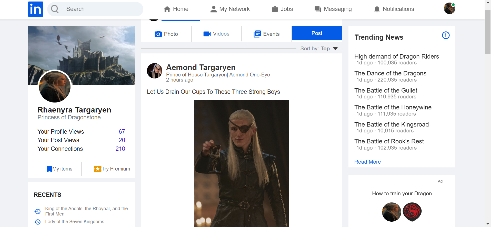
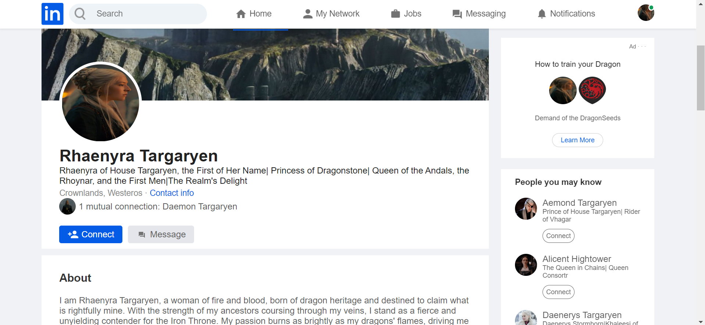

# Linkedin Profile of Rhaenyra targaryen 

This repository contains the code for a LinkedIn clone built using HTML and CSS. It aims to replicate some of the core features and styling of the LinkedIn platform.


## Table of Contents
- [Description](#description)
- [Features](#features)
- [Screenshots](#screenshots)
- [Installation](#installation)
- [Usage](#usage)
- [Contributions](#contributions)
- [License](#license)

## Description

This project is a LinkedIn clone that demonstrates the use of HTML and CSS to recreate the look and feel of the LinkedIn social media platform. It serves as a learning exercise in web development and front-end design.

## Features

- User authentication and registration
- User profiles with professional information
- News feed with posts and updates
- Like and comment functionality
- Basic responsive design for different screen sizes


## Screenshots

1. 



2. 




## Installation

1. Clone the repository:
`git clone https://github.com/shro-2002/HTML-and-CSS/tree/main/linkedinclone`

2. Navigate to the project directory:
```bash
  cd my-project
```
3. Interact with the user interface to see the responsiveness and basic functionality.
    

## Contributions

Contributions are welcome! If you find any bugs or would like to improve the project, feel free to open an issue or submit a pull request. Please follow the [contribution guidelines](CONTRIBUTING.md).

## License

This project is licensed under the MIT License - see the [LICENSE](LICENSE) file for details.

---


Feel free to connect with me on email! ghoshshro2002@gmail.com
